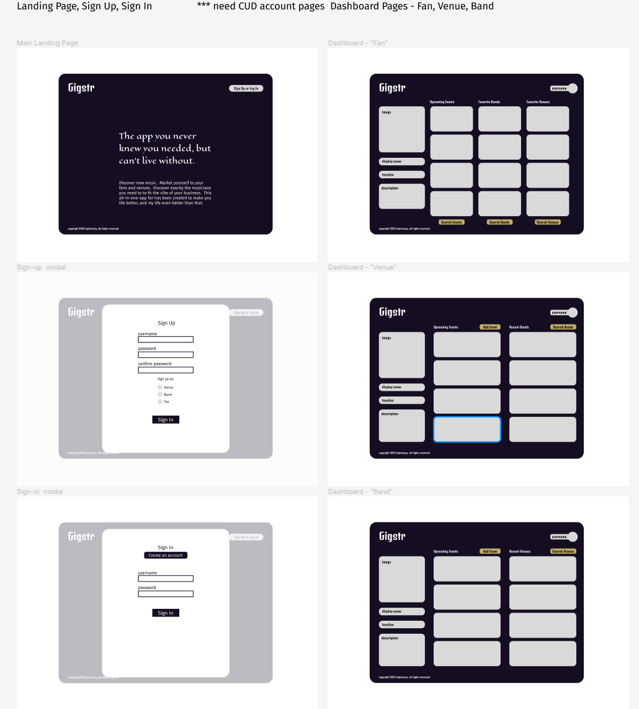
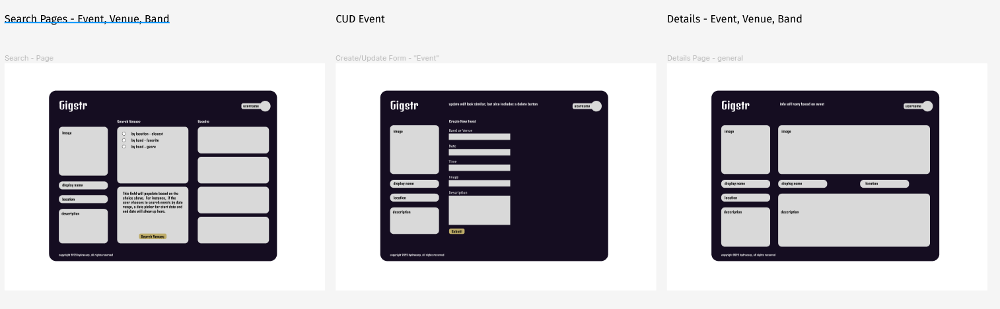

# Gigstr - A Live Music Discovery App

## Overview

Gigster is an app dedicated to sharing live music data between and among bands, venues and fans. A band or venue can post about an upcoming event, including venue info, date, and time. A venue owner or booking agent can post general information about their venue including location and venue type (restaurant, bar, club, etc). A fan or event-seeker should be able to search events by various properties (venue, date, location) and save events to their dashboard.

## Goals Summary

There are three distinct user-types for the app: _band_, _venue_, and _fan_, and referred to as such in the remaining documentation. Any user will be described as 'user'.

### User Stories

-   as a user, i want to be able to sign up for an account
-   as a user, i want to be able to login and logout
-   as a user, i want to search for all relevant information on the database
-   as a use, i should have an interactive and enjoyable experience on any device
-   as a _band_, i want to be able to display a page including relevant information about myself/us
-   as a _band_, i want to display upcoming events to my fans
-   as a _venue_, i want to be able to display a page including relevant information about us
-   as a _venue_, i want to display upcoming events to my fans
-   as a _fan_, i want to be able to search for musicians based on name, style, or venue included in upcoming events
-   as a _fan_, i want to be able to search for venues based on name, loacation, or musicians in upcoming events
-   as a _fan_, i want to be able to show my appreciation to my favorite musicians and/or venues by 'heart'-ing them
-   as a _fan_ i want to indicate that i am interested in attending ('star') a specific event

### MVP

-   user authentication and authorization, including signup, login, and log out
-   _band_ can create, edit, and delete ('owned') events and can edit their own profile
    -   profile includes a few details, linked with Google Places API, and a list of associated events
-   _venue_ can create, edit, and delete ('owned') events, verify events posted by bands, and can edit their own profile
    -   profile includes a few details and a list of associated events
-   _fan_ can:
    -   view their dashboard, which is populated by all upcoming events from 'hearted' _venues_ and/or _bands_, and all 'starred' events
    -   search for venues, bands, and/or events
    -   view venues' or bands' profile, and from here:
    -   view all posted and verified events
        -   'heart' (like) a venue or musician
        -   'star' (imply they are going to) an event

### Stretch Goals

-   searchable tags can be set on _venues_, _bands_, events, and musicians
-   _bands_ and _venues_ able to add music and video to their profile
-   private messaging between _bands_ and _venues_
-   additional functionality and metrics for _bands_ and _venues_, including
    -   payment (basically locking in the agreed payment, a very 'casual' contract) for an event
    -   _venues_ can log sales/customer count/etc. for an event; _fan_ can check-in to an event, so _venue_ and _band_ can get a pulse on _fan_ engagement
    -   system whereby _venues_ and _bands_ can get suggestions to either hire or play respectively, based on history.
    -   each musician in a _band_ can have their own profile page

## Technologies Used

-   HTML
-   CSS
-   django
-   django templates
-   Google Places API (and potentially google maps API) or mapbox API
-   AWS Amazon S3

## Coding Challenges and Opportunities
This project will take what we learned about the Django backend and build upon that functionaity.  The primary concepts necessary to complete this project but not covered specifically during the course will be 
-   setting up and allowing a user to choose from multilple user types
-   integrating location finding API along many steps in the process.

Because of this additional backend complexity, I have decided to forego using React as the frontend, and stick with Django for the completion of the this project.

## Route Tables
UserProfile - each user will need to update their profile. still not 100%  how this works, if i need a separate profile route for each user

route     | controller | action
----------|------------|-------
/profile/ | UserProfile| update user profile

Event CRUD

route     | controller | action
----------|------------|-------
events/   | event      | event index
events/<int: event_id> | event | event detail
events/create/ | event | event create
events/<int: pk>/update/ | event | event update
events/<int: pk>/delete | event | event delete

## Wireframes

## ERD

